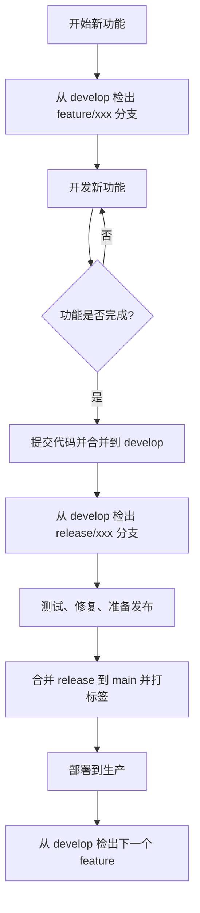

# Agent Project Manager - Git管理规范

> **文档版本**: 1.0
> **生成日期**: 2026-02-20
> **适用范围**: Agent Project Manager 项目开发团队
> **目标**: 为AI代理提供清晰的Git操作指导，实现规范化的多分支管理

---

## 📋 目录

- [工作流概览](#工作流概览)
- [分支策略](#分支策略)
- [提交规范](#提交规范)
- [发布流程](#发布流程)
- [标签管理](#标签管理)
- [何时进行什么操作](#何时进行什么操作)
- [AI辅助命令](#ai辅助命令)
- [常见场景](#常见场景)
- [禁止操作](#禁止操作)

---

## 🔄 工作流概览

### 整体策略

本项目采用 **GitFlow工作流**的简化版本，结合AI项目开发的特点：

```
          main (生产)
         /   \
       develop (开发集成分支)
      /  |  \
   feature/*  feature 分支（新功能）
   hotfix/*   hotfix 分支（紧急修复）
   release/*  release 分支（发布准备）
```

### 工作流图



### 适用场景

| 场景 | 使用分支 | 合并目标 | 说明 |
|------|---------|---------|------|
| 新功能开发 | `feature/xxx` | `develop` | 新功能独立开发完成后合并 |
| 紧急Bug修复 | `hotfix/xxx` | `main` 和 `develop` | 紧急修复需快速发布到生产 |
| 版本发布 | `release/x.y.z` | `main` | 准备发布版本时使用 |
| 小改进 | `develop` 分支直接 | `develop` | 小改动直接在develop上进行 |
| 实验/POC | `experimental/xxx` | `develop` | 实验性功能，可能不合并 |

---

## 🌳 分支策略

### 分支类型定义

#### main 分支

- **用途**: 生产环境代码，只包含稳定的、经过测试的代码
- **保护规则**:
  - ❌ 禁止直接推送到 main
  - ❌ 禁止直接在 main 上提交代码
  - ✅ 只能通过 Pull Request 或 Merge Request 合并
- **内容**: 每次发布后包含完整的功能版本
- **生命周期**: 永久存在，受保护

#### develop 分支

- **用途**: 开发集成分支，最新的开发代码
- **保护规则**:
  - ✅ 可以直接推送到 develop
  - ✅ 开发者可以在 develop 上自由提交
- **内容**: 包含所有已完成的 feature 分支
- **生命周期**: 永久存在，主要开发分支

#### feature 分支

- **命名格式**: `feature/<功能描述>`
- **用途**: 开发单个新功能或重大改进
- **创建方式**: 从 develop 检出
- **合并目标**: 开发完成后合并回 develop
- **生命周期**: 临时分支，合并后可删除
- **示例**:
  - `feature/user-authentication`
  - `feature/ai-chat-interface`
  - `feature/git-integration`

#### hotfix 分支

- **命名格式**: `hotfix/<问题描述>`
- **用途**: 紧急修复生产环境的Bug
- **创建方式**: 从 main 检出（注意：不是从 develop）
- **合并目标**: 同时合并到 main 和 develop
- **生命周期**: 临时分支，合并后可删除
- **示例**:
  - `hotfix/login-token-expiry`
  - `hotfix/ai-response-cors-error`

#### release 分支

- **命名格式**: `release/<主版本号>.<次版本号>`
- **用途**: 准备发布版本，进行最后的测试和文档更新
- **创建方式**: 从 develop 检出
- **合并目标**: 合并到 main 并创建 Git 标签
- **生命周期**: 临时分支，发布后可删除
- **示例**:
  - `release/1.0.0`
  - `release/1.1.0`
  - `release/2.0.0`

#### experimental 分支

- **命名格式**: `experimental/<功能描述>-<开发者>`
- **用途**: 实验性功能、POC验证，可能不会合并到主分支
- **创建方式**: 从 develop 检出
- **生命周期**: 长期存在或根据决定删除
- **示例**:
  - `experimental/voice-interface-john`
  - `experimental/plugin-sandbox-mary`

### 分支保护

```
main 分支：受保护，需要 PR/MR 才能修改
develop 分支：不受保护，团队可直接推送
其他分支：临时分支，合并后应删除
```

---

## ✍ 提交规范

### Commit Message 格式

采用 **Conventional Commits** 规范：

```
<type>(<scope>): <subject>

<body>

<footer>
```

### Type 类型

| Type | 描述 | 使用场景 |
|------|------|----------|
| **feat** | 新功能 | 实现新功能 |
| **fix** | Bug 修复 | 修复 Bug |
| **docs** | 文档修改 | 文档变更 |
| **style** | 代码格式 | 格式调整（不影响功能） |
| **refactor** | 重构 | 代码重构（不影响功能） |
| **perf** | 性能优化 | 性能改进 |
| **test** | 测试相关 | 添加或修改测试 |
| **chore** | 构建/工具 | 构建过程或工具链变更 |
| **ci** | CI 配置 | CI/CD 配置变更 |
| **revert** | 回滚 | 回滚之前的提交 |

### Scope 范围

| Scope | 说明 | 示例 |
|-------|------|------|
| **auth** | 认证相关 | `feat(auth): add OAuth2 support` |
| **ai-hub** | AI Hub | `fix(ai-hub): handle stream error` |
| **project** | 项目管理 | `refactor(project): extract task service` |
| **git** | Git 集成 | `feat(git): add clone repository` |
| **terminal** | 终端 | `perf(terminal): optimize command execution` |
| **integration** | 集成 | `fix(integration): fix Jira API call` |
| **notification** | 通知 | `feat(notification): add toast notifications` |
| **ui** | UI 组件 | `style(ui): adjust button colors` |
| **db** | 数据库 | `refactor(db): add index to query` |
| **config** | 配置 | `chore(config): update env variables` |
| **deps** | 依赖 | `chore(deps): upgrade NestJS to v10` |
| **tests** | 测试 | `test(project): add unit tests` |
| **infra** | 基础设施 | `feat(infra): setup Redis cache` |

### Subject 主题

- **使用祈使句**，首字母小写
- **不超过 50 个字符**
- **简洁描述做了什么**

### Body 正文

- **使用祈使句**，首字母小写
- **详细描述做了什么和为什么**
- **可多行**
- **每行不超过 72 个字符**

### Footer 页脚

- **包含相关 Issue 编号**
- **格式**: `Closes #123`, `Fixes #456`
- **多使用逗号分隔**

### 完整示例

#### 功能开发提交

```bash
git commit -m "feat(ai-hub): add streaming AI response

Implement real-time streaming for AI chat responses using Socket.IO
to improve user experience during long AI operations.

Closes #234
Refs #123"
```

#### Bug 修复提交

```bash
git commit -m "fix(auth): resolve token expiration issue

Users were being logged out unexpectedly due to JWT token not being
refreshed. Now checking token expiration before each API call.

Closes #156"
```

#### 文档更新提交

```bash
git commit -m "docs(readme): update deployment instructions

Add detailed steps for Docker setup and environment configuration.
Update security section with CORS and rate limiting recommendations.

Closes #89"
```

#### 重构提交

```bash
git commit -m "refactor(project): extract task creation logic

Move task creation logic to a dedicated TaskService to improve
code organization and testability. This change doesn't affect functionality.

Closes #201"
```

---

## 🚢 发布流程

### 版本号规范

采用 **语义化版本**（Semantic Versioning）：

```
<主版本号>.<次版本号>.<修订号>
```

| 版本号 | 说明 | 示例 |
|--------|------|------|
| **主版本号（MAJOR）** | 不兼容的 API 变更 | `1.0.0` → `2.0.0` |
| **次版本号（MINOR）** | 向下兼容的功能新增 | `1.0.0` → `1.1.0` |
| **修订号（PATCH）** | 向下兼容的问题修复 | `1.0.0` → `1.0.1` |

### AI 项目版本策略

由于 AI 项目迭代快速，采用更灵活的策略：

| 开发阶段 | 版本规则 | 示例 |
|----------|---------|------|
| **早期开发（0.x.x）** | 主版本 0，次版本递增 | `0.1.0` → `0.2.0` → `0.3.0` |
| **Beta 阶段（1.x.x）** | 主版本 1，次版本递增 | `1.0.0` → `1.1.0` |
| **GA 阶段（2.x.x）** | 主版本 2，次版本递增 | `1.0.0` → `2.0.0` |
| **LTS 阶段（3.x.x）** | 主版本 3，次版本递增 | `3.0.0` → `3.1.0` |

**Pre-release 标识**:
- `alpha`: 内部测试版本
- `beta`: 公开测试版本
- `rc`: Release Candidate

示例：`1.2.0-beta.1`, `2.0.0-rc.1`

### 发布检查清单

在发布前必须完成以下检查：

- [ ] 所有单元测试通过
- [ ] 所有集成测试通过
- [ ] E2E 测试通过
- [ ] 代码审查通过
- [ ] 安全扫描无高危问题
- [ ] 文档已更新
- [ ] CHANGELOG.md 已更新
- [ ] 版本号已更新
- [ ] 无 `console.log` 或调试代码
- [ ] 没有 TODO 或 FIXME 标记（除非在追踪）

### 发布流程步骤

#### 1. 创建 release 分支

```bash
# 确保在 develop 分支
git checkout develop
git pull origin develop

# 检出 release 分支
git checkout -b release/1.2.0

# 更新版本号（更新 package.json）
# 运行测试
npm run test
npm run test:e2e

# 如果测试通过，继续发布
# 如果测试失败，修复问题或取消发布
```

#### 2. 合并到 main 并打标签

```bash
# 切换到 main
git checkout main
git pull origin main

# 合并 release 分支
git merge --no-ff release/1.2.0

# 创建 Git 标签（带注释）
git tag -a v1.2.0 -m "Release version 1.2.0

# 推送 main 和标签
git push origin main
git push origin v1.2.0

# 合并回 develop（保持同步）
git checkout develop
git merge main
git push origin develop

# 删除 release 分支（可选）
git branch -d release/1.2.0
```

#### 3. 更新 CHANGELOG

```markdown
# CHANGELOG.md

## [1.2.0] - 2026-02-20

### Added
- Feature: AI streaming responses for improved UX
- Feature: Git workspace management interface
- Enhancement: Real-time notifications system
- Improvement: Performance optimizations with Redis cache

### Fixed
- Bug: JWT token expiration handling
- Bug: API response type mismatches
- Bug: CORS configuration security issue
- Bug: Socket.IO event type safety

### Changed
- Refactor: Common infrastructure implementation
- Refactor: API response type system
- Breaking: Updated Prisma schema with migrations

### Security
- Fixed: Encryption key hardcoding vulnerability
- Fixed: Deprecated crypto API usage
- Added: Rate limiting to API endpoints
- Added: CSRF protection
```

#### 4. 部署（如果自动部署）

```bash
# CI/CD 会自动部署
# 手动部署步骤：
npm run build:backend
npm run build:frontend
# 部署到服务器
```

---

## 🏷 标签管理

### 标签命名规范

#### 版本标签

- **格式**: `v<版本号>`
- **用途**: 标记生产环境的发布版本
- **示例**: `v1.0.0`, `v1.2.0`, `v2.0.0`
- **创建时机**: release 分支合并到 main 时
- **推送规则**: 必须推送标签到远程

#### 预发布标签

- **格式**: `v<版本号>-<prerelease>`
- **用途**: 标记预发布版本（alpha, beta, rc）
- **示例**: `v1.2.0-beta.1`, `v2.0.0-rc.1`
- **创建时机**: 测试版本发布时

#### 自动生成的标签

CI/CD 流程可能会自动创建以下标签：

- **构建标签**: `build-<commit-hash>` - 每次构建自动创建
- **部署标签**: `deploy-<environment>-<timestamp>` - 部署时自动创建

### 标签最佳实践

- ✅ 标签应该有描述性的注释
- ✅ 标签应该签名（生产发布）
- ✅ 不要随意修改已推送的标签
- ✅ 删除错误的标签要小心（force push）
- ✅ 定期清理旧的构建标签

### 标签签名

```bash
# 配置 GPG 签名
git config user.signingkey <your-key-id>

# 创建带签名的标签
git tag -s v1.2.0 -m "Release version 1.2.0"
```

---

## 🎯 何时进行什么操作

### AI 开发阶段判断标准

#### 开发阶段定义

| 阶段 | 描述 | Git 操作 |
|------|------|---------|
| **POC 验证** | 验证想法可行性 | 创建 `experimental/` 分支，频繁提交 |
| **功能开发** | 实现具体功能 | 创建 `feature/` 分支，按功能提交 |
| **集成测试** | 测试功能集成 | 在 `feature/` 分支上提交测试 |
| **代码审查** | 等待审查反馈 | 创建 PR/MR，根据反馈修改 |
| **合并到 develop** | 功能完成 | 合并到 `develop` 分支 |
| **发布准备** | 准备发布 | 创建 `release/` 分支，测试和文档 |

#### AI 特定的工作模式

| 开发模式 | 分支策略 | 提交频率 | 合并策略 |
|----------|---------|----------|---------|
| **快速迭代模式** | 单 feature 分支 | 每完成一个小步骤就提交 | 完成后立即合并 |
| **功能完整模式** | 单 feature 分支 | 功能全部完成再提交 | 功能完整后再合并 |
| **实验探索模式** | experimental 分支 | 极其频繁提交 | 不合并或延后决定 |

### 何时创建分支

#### 创建 feature 分支

```
触发条件：
✅ 完成 P0-TS 修复（如果有）
✅ 开始新功能开发
✅ 需要独立开发环境

操作：
git checkout develop
git pull origin develop
git checkout -b feature/<功能描述>

示例：
git checkout develop
git pull origin develop
git checkout -b feature/ai-chat-streaming
```

#### 创建 hotfix 分支

```
触发条件：
✅ 生产环境发现紧急 Bug
✅ 需要立即修复

操作：
git checkout main
git pull origin main
git checkout -b hotfix/<问题描述>

示例：
git checkout main
git pull origin main
git checkout -b hotfix/login-cors-fix
```

#### 创建 release 分支

```
触发条件：
✅ develop 分支准备好发布
✅ 所有功能已合并到 develop
✅ 测试通过
✅ 文档已更新

操作：
git checkout develop
git pull origin develop
git checkout -b release/<版本号>

示例：
git checkout develop
git pull origin develop
git checkout -b release/1.2.0
```

### 何时提交代码

#### 提交时机

```
✅ 完成一个逻辑单元或功能点
✅ 修复一个 Bug
✅ 完成代码审查反馈
✅ 完成测试（单元测试、集成测试）
✅ 文档更新

❌ 不要：
  - 仅仅保存代码（频繁且无意义）
  - 混合多个不相关的更改
  - 在有未提交的文件时切换分支
```

#### 提交粒度

| 粒度 | 说明 | 示例 |
|------|------|------|
| **原子提交** | 单个逻辑单元 | `feat(auth): add user login` |
| **功能级提交** | 完成一个小功能 | `feat(ai-hub): add chat interface` |
| **主题级提交** | 完成一个大主题 | `refactor(project): complete API refactor` |

**AI 项目建议**：倾向于原子提交和功能级提交，便于代码审查和回滚。

### 何时创建 Pull Request

#### 创建 PR 的时机

```
✅ feature 分支开发完成
✅ 所有测试通过
✅ 代码已推送到远程
✅ 代码审查完成（自审）

PR 模板：
Title: [type] <feature 分支名>: <简要描述>

Description:
## 相关 Issue
Closes #123

## 变更说明
[详细描述这个 PR 的变更]

## 测试情况
- [x] 单元测试通过
- [x] 集成测试通过
- [x] 手动测试通过

## 截图/视频
（可选：如果有 UI 变更，添加截图或视频）

## 检查清单
- [ ] 代码符合提交规范
- [ ] 没有新的 lint 错误
- [ ] 代码已格式化
- [ ] 没有调试代码
```

### 何时合并代码

#### 合并策略

| 场景 | 合并方式 | 说明 |
|------|---------|------|
| **feature → develop** | Merge Request (MR) | 在 GitLab/GitHub 上创建 MR 并审查 |
| **hotfix → main** | Fast-forward merge | 直接合并，保持 main 简洁历史 |
| **hotfix → develop** | Merge Request (MR) | 确保修复也应用到开发分支 |
| **release → main** | Fast-forward merge | 使用 `--no-ff` 保留合并记录 |
| **release → develop** | Fast-forward merge | 同步 develop 分支 |

#### 合并命令

```bash
# Merge Request 合并（推荐，有审查记录）
git checkout develop
git pull origin develop
git merge --no-ff feature/xxx
git push origin develop

# Fast-forward 合并（main 和 release）
git checkout main
git merge --no-ff release/1.2.0
git push origin main

# Squash 合并（可选，保持历史清晰）
git merge --squash feature/xxx
git push origin develop
```

### 何时进行代码审查

#### 审查时机

```
✅ feature 分支开发完成
✅ 创建 Pull Request/Merge Request
✅ 至少一名其他开发者审查

审查重点：
- 代码质量和规范
- 架构设计合理性
- 测试覆盖
- 安全问题
- 性能考虑
```

#### 审查工具建议

- **GitHub**: 使用 GitHub Pull Request Review 功能
- **GitLab**: 使用 GitLab Merge Request
- **本地工具**: （可选）使用 Review Board、GitKraken 等

### 何时删除分支

#### 删除时机

```
✅ feature 分支已合并到 develop
✅ hotfix 分支已合并到 main 和 develop
✅ release 分支已合并到 main 并打标签
✅ experimental 分支决定不采用或已完成
```

#### 删除命令

```bash
# 删除已合并的 feature 分支
git branch -d feature/xxx

# 删除本地和远程的已合并分支
git push origin --delete feature/xxx
```

### 何时处理冲突

#### 冲突处理流程

```
1. 保持冷静，不要恐慌
2. 拉取最新的 develop 分支代码
   git fetch origin develop
3. 解决冲突
4. 提交解决后的代码
   git commit -m "fix: resolve merge conflicts"
5. 继续完成工作
```

#### AI 辅助建议

```bash
# 使用 AI 工具帮助解决冲突
# 示例：使用 ChatGPT、GitHub Copilot 等解释冲突

# 常见冲突类型：
# - 同一文件不同位置修改
# - 方法签名变更
# - 重命名文件/文件夹
# - 二进制冲突（图片、数据文件）
```

---

## 🤖 AI 辅助命令

### 便捷别名配置

在 `~/.gitconfig` 或项目的 `.git/config` 中添加：

```ini
[alias]
    # 工作流相关
    start-feature = !f() { git checkout develop && git pull && git checkout -b feature/$1; }
    start-hotfix = !f() { git checkout main && git pull && git checkout -b hotfix/$1; }
    sync-develop = !f() { git checkout develop && git pull origin develop; }
    sync-main = !f() { git checkout main && git pull origin main; }

    # 提交相关
    amend = commit --amend --no-edit
    fixup = !f() {
        git add -A &&
        git commit -m "fixup: $(git log -1 --pretty=%B)" &&
        git rebase HEAD~1;
    }

    # 分支管理
    delete-merged = !git branch --merged | grep -v '\\*' | xargs git branch -d
    prune-branches = !git fetch --prune && git branch --merged | grep -v '\\*' | xargs git branch -d

    # 历史查看
    recent = log --oneline -10 --graph --all
    timeline = log --pretty=format:'%h %ad %s' --since='2 weeks ago'

    # 状态查看
    status-s = status -sb
    unpushed = !git log origin/..HEAD --oneline --no-merges

    # AI 请求前准备
    prepare-for-ai = !git diff --stat && git status
```

### 使用示例

```bash
# 开始新功能
git start-feature ai-chat-streaming

# 同步 develop
git sync-develop

# 删除已合并的分支
git delete-merged

# 修复最近的提交
git fixup

# 查看最近的提交历史
git recent

# 同步状态
git status-s
```

### Git Hook 配置

#### Pre-commit Hook

```bash
# .git/hooks/pre-commit
#!/bin/bash

# 检查提交信息格式
echo "检查提交信息格式..."

# 检查代码风格
npm run lint

# 运行相关测试
npm run test:unit

# 检查是否有大文件
files=$(git diff --cached --name-only --diff-filter=A)
large_files=$(find $files -size +100k 2>/dev/null)
if [ -n "$large_files" ]; then
    echo "警告：发现大文件，请确认是否需要提交"
    exit 1
fi

exit 0
```

#### Commit Message Hook

```bash
# .git/hooks/commit-msg
#!/bin/bash

# 验证提交信息格式
msg_file=$1
msg=$(cat $msg_file)

# 正则表达式匹配 Conventional Commits
pattern='^(feat|fix|docs|style|refactor|perf|test|chore|ci|revert)(\(.+\))?: .{50}'

if [[ ! $msg =~ $pattern ]]; then
    echo "❌ 提交信息格式不符合规范！"
    echo "✅ 正确格式: feat(ai-hub): add streaming support"
    exit 1
fi

exit 0
```

### CI/CD 集成

```yaml
# .github/workflows/ci.yml
name: CI

on:
  push:
    branches: [ main, develop, 'feature/**', 'hotfix/**']
    tags:
      - 'v*'

jobs:
  validate:
    runs-on: ubuntu-latest
    steps:
      - uses: actions/checkout@v4
      - name: Validate Commit Messages
        uses: wagoid/commitlint-github-action@v5

      - name: Lint Code
        run: npm run lint

      - name: Run Tests
        run: npm test

  deploy:
    needs: validate
    if: github.ref == 'refs/heads/main'
    runs-on: ubuntu-latest
    steps:
      - name: Deploy to Production
        run: npm run deploy:prod
```

---

## 📚 常见场景

### 场景 1: 开始新功能开发

```
1. 更新本地 develop 分支
   git checkout develop && git pull origin develop

2. 创建新的 feature 分支
   git checkout -b feature/<功能描述>

3. 开发功能（小步提交）
   git add .
   git commit -m "feat(module): implement basic structure"
   git commit -m "feat(module): add API integration"
   ...

4. 推送并创建 Merge Request
   git push origin feature/xxx
   # 在 GitLab/GitHub 上创建 MR

5. 等待审查和合并
   # 根据反馈修改代码
   # MR 合并到 develop 后删除 feature 分支
   git branch -d feature/xxx
```

### 场景 2: 修复紧急 Bug

```
1. 从 main 检出 hotfix 分支
   git checkout main && git pull origin main
   git checkout -b hotfix/<问题描述>

2. 修复 Bug（快速提交）
   git add .
   git commit -m "fix(module): resolve critical bug"

3. 推送并测试
   git push origin hotfix/xxx

4. 合并到 main 和 develop
   git checkout main
   git merge --no-ff hotfix/xxx
   git push origin main

   git checkout develop
   git merge hotfix/xxx
   git push origin develop

5. 删除 hotfix 分支
   git branch -d hotfix/xxx
```

### 场景 3: 准备发布版本

```
1. 确保 develop 分支是最新的
   git checkout develop && git pull origin develop

2. 创建 release 分支
   git checkout -b release/<版本号>

3. 更新版本号和文档
   # 更新 package.json
   # 更新 CHANGELOG.md

4. 运行完整测试套件
   npm run test
   npm run test:e2e

5. 合并到 main 并打标签
   git checkout main
   git merge --no-ff release/<版本号>
   git tag -a v<版本号> -m "Release version <版本号>"
   git push origin main --tags

6. 合并回 develop
   git checkout develop
   git merge main
   git push origin develop

7. 删除 release 分支
   git branch -d release/<版本号>
```

### 场景 4: 同步远程变更

```
1. 查看远程变更
   git fetch origin

2. 查看本地与远程差异
   git status

3. 拉取并合并远程变更
   git pull origin develop
   # 如果有冲突，按"何时处理冲突"流程解决
```

### 场景 5: 代码审查反馈

```
1. 切换到 feature 分支
   git checkout feature/xxx

2. 根据反馈修改
   # 修改代码
   git add .
   git commit -m "fix(module): address code review feedback"

3. 推送更新
   git push origin feature/xxx

4. 更新 MR/PR
   # 在 GitLab/GitHub 上评论说明已修复
```

### 场景 6: 放弃当前工作

```
1. 保存当前工作（如果需要）
   git stash save "WIP: <描述>"

2. 切换到其他分支
   git checkout develop

3. 恢复工作
   git checkout feature/xxx
   git stash pop
```

### 场景 7: 回滚错误的提交

```
1. 查看提交历史
   git log --oneline -10

2. 回滚到指定提交
   # 选项 1: 软回滚（不修改历史）
   git reset --soft HEAD~1

   # 选项 2: 硬回滚（修改历史）
   git reset --hard HEAD~1

   # 选项 3: 使用 revert（推荐，保留历史）
   git revert HEAD

3. 修正后重新提交
   git add .
   git commit -m "fix: correct previous commit"
```

---

## 🚫 禁止操作

### 分支操作禁止

- ❌ **不要直接推送到 main**
  - main 分支是受保护的，应该通过 MR/PR 合并

- ❌ **不要在 main 上开发**
  - 所有开发工作应该在 feature 或 develop 分支上进行

- ❌ **不要在功能未完成时合并**
  - feature 分支应该功能完整且测试通过后才合并

- ❌ **不要随意删除分支**
  - 只删除已合并的或明确废弃的分支

- ❌ **不要长期保留大量未合并分支**
  - 定期清理已废弃的 feature 分支（超过 2 周）

### 提交操作禁止

- ❌ **不要使用模糊的提交信息**
  - ❌ "update code"
  - ❌ "fix stuff"
  - ❌ "wip"
  - ✅ "feat(ai-hub): add streaming response"

- ❌ **不要混合不相关的变更**
  - 应该按照功能或模块分开提交

- ❌ **不要提交调试代码**
  - ❌ `console.log`
  - ❌ `debugger`
  - ❌ `alert`

- ❌ **不要提交敏感信息**
  - ❌ API 密钥
  - ❌ 密码
  - ❌ Token
  - ❌ 环境变量

- ❌ **不要在 PR/MR 合并中使用 squash**
  - 保持提交历史清晰，便于追踪和回滚

### 合并操作禁止

- ❌ **不要使用 `git push --force`**（除非紧急情况）
  - 可能覆盖他人工作，造成数据丢失

- ❌ **不要合并冲突后立即推送**
  - 应该先测试，确保功能正常

- ❌ **不要合并未经审查的代码**
  - 所有功能分支都应该经过代码审查

### AI 项目特定禁止

- ❌ **不要将大文件（如模型文件）提交到 Git**
  - 使用 `.gitignore` 排除大文件
  - 如需要，使用 Git LFS 或外部存储

- ❌ **不要提交依赖目录**
  - `node_modules/`
  - `dist/`
  - `.next/`

- ❌ **不要提交生成的文件**
  - 构建产物
  - 缓存文件
  - 测试覆盖率报告（在 CI 中生成）

---

## 📊 Git 最佳实践总结

### 日常开发

1. **频繁提交** - 小步提交，每次提交都是一个完整的功能点
2. **清晰的提交信息** - 使用 Conventional Commits 规范
3. **分支隔离** - 每个功能独立分支开发
4. **及时同步** - 定期拉取远程变更
5. **保持历史清晰** - 合并时使用 `--no-ff`，避免不必要的 squash
6. **测试驱动** - 先写测试，再实现功能

### 协作开发

1. **Pull Before Work** - 每天开始工作前先拉取最新代码
2. **小任务分支** - 每个小任务或 Bug 修复创建单独分支
3. **及时的代码审查** - 创建 MR/PR 后及时请求审查
4. **保持主分支同步** - 合并到 develop 后立即推送
5. **使用 Issue 追踪** - 将 MR/PR 关联到 Issue

### 发布管理

1. **版本语义化** - 遵循 Semantic Versioning 规范
2. **发布检查清单** - 确保所有检查项完成
3. **CHANGELOG 维护** - 每次发布都更新 CHANGELOG
4. **标签管理** - 发布时创建对应的版本标签
5. **回滚计划** - 准备好回滚方案

### 安全性

1. **敏感信息保护** - 使用 `.gitignore` 和 `.env.local`
2. **密钥管理** - 使用环境变量，不要硬编码密钥
3. **访问控制** - 合理配置仓库访问权限
4. **依赖审计** - 定期检查依赖安全性

### AI 项目特性

1. **实验性功能** - 使用 `experimental/` 分支隔离实验代码
2. **快速迭代** - 功能小步迭代，频繁合并
3. **自动化测试** - 利用 CI/CD 自动运行测试
4. **文档同步** - 代码和文档保持同步更新
5. **AI 辅助开发** - 合理使用 AI 工具提高效率

---

## 🔧 工具配置

### .gitignore 配置

```gitignore
# Node
node_modules/
npm-debug.log*
yarn-debug.log*
yarn-error.log*
lerna-debug.log*

# 构建产物
dist/
build/
*.tgz

# 环境变量
.env
.env.local
.env.*.local

# IDE
.vscode/
.idea/
*.swp
*.swo
*~

# 测试
coverage/
.nyc_output/

# 操作系统
.DS_Store
Thumbs.db

# AI 项目特定
*.db
*.sqlite
*.sqlite3
models/
checkpoints/
logs/

# 临时文件
*.tmp
*.temp
```

### Git 配置

```ini
[core]
    editor = vim
    filemode = true
    logallrefupdates = true

[user]
    name = Your Name
    email = your.email@example.com

[color]
    ui = true
    diff = auto

[alias]
    # 工作流别名
    start-feature = !f() { git checkout develop && git pull && git checkout -b feature/$1; }
    start-hotfix = !f() { git checkout main && git pull && git checkout -b hotfix/$1; }
    sync-develop = !f() { git checkout develop && git pull origin develop; }
    sync-main = !f() { git checkout main && git pull origin main; }
```

---

## 🎓 快速参考

### Git 命令速查表

| 命令 | 说明 | 示例 |
|------|------|------|
| `git status` | 查看工作区状态 | |
| `git add .` | 添加所有更改 | |
| `git commit -m "..."` | 提交更改 | |
| `git push` | 推送到远程 | |
| `git pull` | 拉取远程变更 | |
| `git fetch` | 获取远程信息 | |
| `git branch -a` | 查看所有分支 | |
| `git checkout -b <name>` | 创建新分支 | |
| `git checkout <name>` | 切换分支 | |
| `git merge <branch>` | 合并分支 | |
| `git branch -d <branch>` | 删除分支 | |
| `git log --oneline` | 查看提交历史 | |
| `git diff` | 查看差异 | |
| `git stash` | 暂存工作 | |
| `git stash pop` | 恢复工作 | |
| `git reset --soft HEAD~1` | 撤销上次提交 | |
| `git revert HEAD` | 回滚提交 | |

### 提交信息格式速查

```
feat: 新功能
fix: Bug 修复
docs: 文档更新
style: 代码格式调整（不影响逻辑）
refactor: 重构（不影响逻辑）
perf: 性能优化
test: 测试相关
chore: 构建/工具链
ci: CI/CD 配置
revert: 回滚之前的提交
```

---
